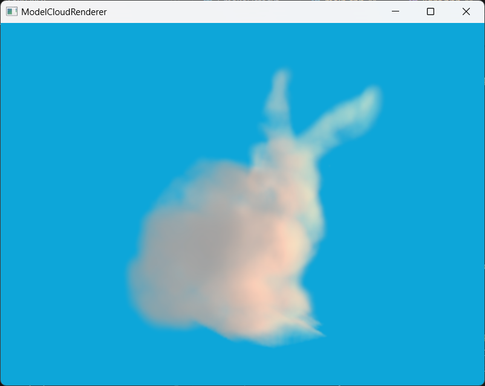
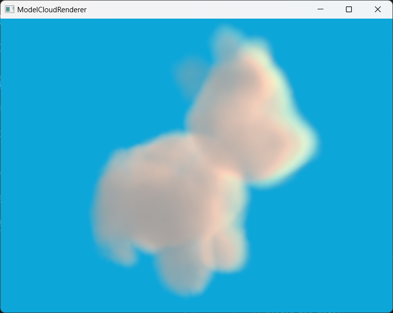
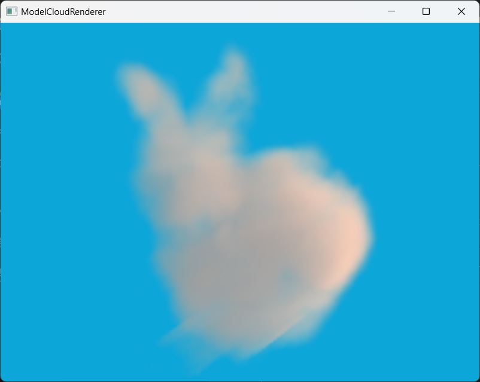

# Model Volumetric Renderer

## how to build
Please check [this repo](https://github.com/theamusing/OpenGL_Template). It's exactly the same.

## features
This repository is a tiny volumetric renderer.

It can transform a mesh model into **Signed Distance Field(SDF)** and render it into clouds using volumetric rendering.

You can generate a volume from a model path (see [main.cpp](./src/main.cpp)) and render it in the main loop. You can use your own model as long as the model is a closed polygon mesh.
```
    // load models
    // -----------
    Volume myVolume("../resources/models/spot/spot.obj");
```


The volume can be lit up by any types of light in the light system. For example, you can change the light settings to sunset like.
```
    LightManager sunset;
    sunset.setAmbientLight(glm::vec3(0.3f, 0.3f, 0.3f));
    sunset.setDirectionalLight(
        glm::vec3(-1.0f, 0.5f, 1.0f), 
        glm::vec3(1.0f, 0.4f, 0.0f), 
        5.0f
    );
    ...
    sunset.Apply(volumeShader);
```


*(Since the ray-marching process is really costly, I don't recommand you to use too many lights at the same time.)*

The default ray-marching process takes 128 steps, and 16 steps from each voxel to light sources, which are defined as **MAX_STEPS** and **MAX_LIGHT_STEPS** in the [volume.frag](./resources/shaders/volume.frag) file. If the program doesn't run smoothly on your computer, try to decrease these value.

If you want to change the density and frequency of the cloud, just modity the value of **density_threshold** and **freq** in function **cloudDensity** in file [model2sdf.comp](./resources/shaders/model2sdf.comp). Maybe I should set these values to uniform variaties, but I'm just being lazy, whatever :(

## tutorial
This section contains a tutorial about how to generating SDF and some volumetric rendering techniques.

### introduction to SDF
The first step we need is to generate a 3D signed distance field from our model. 

Imagine you have a model and a bounding box for the model(for example, an AABB box). For each point in that bounding box, you can determine whether the point is **inside** the model, and you can tell how close the point is to its nearest mesh of the model. 

This is what a SDF records. A 3D SDF is basically a 3d texture related to a bounding box, each pixel in it shows the distance of a point to the nearest triangle face. So why is it called **Signed** Distance Field? When the point is inside the model, the value of the distance will be recorded negative, and vise versa, so you knows whether a point is inside the model or not.

Here is an example of a 2D SDF. The black circle is the edge. 3D SDF is similar. 


### generate SDF from model
So how to generate a 3D SDF from a mesh model? First we need to know if the point is inside the model, and how close it is to the nearest triangle.

Here is a simple solution: From any point in the bounding box, we generate a random ray, and count how many times it intersects with mesh faces. If the model is a closed mesh model, then any point inside it will intersect odd times with the edge of the model. Then we can calculate the point's distance toward every mesh faces and get the nearest one.

Here's the pseudo code for this algorithm. You can also check [model2sdf.comp](./resources/shaders/model2sdf.comp) for more information.
```
    for every pixel in a 3D SDF texture:
        count = 0
        distance = INF
        for every triangle faces of the model:
            rayOrigin = get_world_pos_from_pixel_coordinate(pixel.coord)
            rayDirection = whatever_direction_you_like
            if ray_intersect_with_triangle(rayOrigin, rayDirection, face):
                count++
                distance = min(distance, distance_to_triangle(rayOrigin, face))
        if count % 2 == 1 // odd intersection, the point is inside the model
            distance = -distance // set to negative value
        record_distance_to_SDF(pixel.coord, distance)
```
In practice, I used AABB box as the model's bounding box, and a 128^3 resolution 3D texture to store the SDF. In this way it's easy to map a pixel coordinate to a world space location.

And I used a compute shader to do it in parallel. Check [model2sdf.comp](./resources/shaders/model2sdf.comp) for more information.

Here is a result: The white part is inside the bunny, and the black part outside.


You may wonder why we need to calculate the signed distance, since we only need a bool to store whether the point is inside the model or not. We'll talk about it in the next section.

### generate density from noise
Now we get a SDF texture, we can describe the shape of the cloud. It's time to calculate the density within the cloud. 

The most popular way to generate density within the cloud is using noise. Here we use a combination of 3D **Perlin noise** and **Worley noise** to generate cloud-like noise.


```
    // I'm not familiar with the mathematical principles of generating noise and FBM :(
    // Maybe you can just google it.
```

We need to superimpose noises of different frequencies in different proportions to generate **Fractal Brownian Motion(FBM)** and to simulate the cloud. 

You can either use noise textures or dynamically generate noise in your shader. Check [noise.glsl](./resources/shaders/include/noise.glsl) for more information about how to generate noise. *(The functions in this file is copied from a [shadertoy project](https://www.shadertoy.com/view/3dVXDc))*

Finally we can sample the cloud's density. We can combine it with the SDF we just got. 
```
    // sample density of a position
    coord = get_coordinate_from_position(pos)
    density = sample_from_noise(coord)  
    distance = SDF(coord)

    if(distance < 0) // inside the model
        return density
    else
        return 0
```
Here is what it looks like:


This already looks like a cloud. However, you will notice that the edges of the model are still hard and look abrupt. We need to expand the edges a little bit to make it more fluffy. Here is a solution:
```
    // sample density of a position
    coord = get_coordinate_from_position(pos)
    density = sample_from_noise(coord)
    distance = SDF(coord)
    tolerate_distance = some_value_according_to_density

    if(distance < tolerate_distance) // inside the model
        return density * max(distance, 0) / tolerate_distance
    else
        return 0
```
It will give a fluffy outlook:


So now you can see why we need to record a distance in SDF rather than just a bool :)

In practice you also need to expand the AABB box a little bit. 
You can check [volume.hpp](./include/opengl/volume.hpp) and [model2sde.comp](./resources/shaders/model2sdf.comp) to see the implement.

### ray marching
To render a volume, we do not need to send the model's mesh data to GPU. Instead we'll just use the vertices of the AABB box, our SDF texture and the density sampler. And we'll use ray march to render it.

The principle of ray marching is quite easy: For every fragments, generate a ray from your camera towards that fragment, step forward a little bit every time, and accumulate the sampled result together. [Here](https://medium.com/@calebleak/raymarching-voxel-rendering-58018201d9d6) is a good tutorial to learn about ray-marching. For any visible point in a volume, the color of this point is an accumulation of color from points behind it. And we need to know how to accumulate these colors.

As we walk deeper into the fog, the scenes around us become darker. This is because the intensity of light diminishes as the distance increases. We use **transmittance** to describe how much light is able to go through the fog. According to Beer's law, 
```
    transmittance = exp(-accumulated_density)
```

And now we can tell the accumulated transmittance of any given point in the volume.

Here is the pseudo code:
```
    // in fragment shader
    rayOrigin = camera_position
    rayDir = rayOrigin --> fragment_world_position
    stepSize = some_samll_constant_value
    transmittance = 1

    for i in range(MAX_STEP_NUM):
        currentPos = rayOrigin + i * stepSize
        density = sample_density(currentPos)
        transmittance *= exp(-density * stepSize)
    
    return 1 - transmittance // larger the transmittance is, thinner the volume is 
```
Here's a result for the AABB box:


And here's our cute bunny:


You can see [volume.frag](./resources/shaders/volume.frag) for more details.
### lighting
Our final step is to do the lighting. We need to modify our fragment shader a little bit:
```
    // in fragment shader
    rayOrigin = camera_position
    rayDir = rayOrigin --> fragment_world_position
    stepSize = some_samll_constant_value
    transmittance = 1
    color = 0

    for i in range(MAX_STEP_NUM):
        currentPos = rayOrigin + i * stepSize
        density = sample_density(currentPos)
        transmittance *= exp(-density * stepSize)
        currentLight = get_current_color(currentPos)
        color += transmittance * currentLight * stepSize

    return color
```

Light scatters inside the volume. There are basically two types of scattering: inScattering, which scatters inside the volume and lit it up; and outScattering, which scatters outside the volume and take energy away with it. CurrentLight can be basically inScattering * outScattering.
```
    currentLight = inScattering * outScattering
```

OutScattering is related to the current density:
```
    outScattering = some_constant_factor * density
```

InScattering is more complicated.
```
    InScattering = base_color + SUM(phase * transmittance_light * light_color for each light source)
```

Here I'll explain each part of it.

The **phase** function describes the intensity of scattering from light direction toward view direction. When your view direction is closer to the light direction, the scattering will be more intense. 
```
float hgPhase(float g, float cosTheta)
{
    // cosTheta is dot(lightDir, viewDir)
    // g is a controll value from -1 to 1 for different results

    float numer = 1.0f - g * g;
    float denom = 1.0f + g * g + 2.0f * g * cosTheta;
    return numer / (4.0f * PI * denom * sqrt(denom));
}
```
Phase function can lit up the volume from the light direction and generate the silver-lining effect on the clouds. 


In practice, we want to make the cloud look brighter both from the front and from the back of the light direction. So we can use a combined phase function:
```
float dualLobPhase(float g0, float g1, float w, float cosTheta)
{
	return mix(hgPhase(g0, cosTheta), hgPhase(g1, cosTheta), w);
}
```
There are different types of phase functions, you can learn more about it [here](https://cglearn.eu/pub/advanced-computer-graphics/volumetric-rendering#material-the-phase). 

The **transmittance_light** describes how much light can go through the volume to the point. It's similar to the ray-marching process, but this time, you need to march from the given point towards the light:
```
    // in fragment shader
    rayOrigin = given_point
    rayDir = rayOrigin --> light_source
    stepSize = some_samll_constant_value
    transmittance_light = 1

    for i in range(MAX_STEP_NUM):
        currentPos = rayOrigin + i * stepSize
        density = sample_density(currentPos)
        transmittance_light *= exp(-density * stepSize)

    return transmittance_light
```
**With and without light transmittance:**


And here is a little trick: Use
```
    2 * transmittance_light * (1 - transmittance_light ^ 2)
```
instead of 
```
    transmittance_light
```
Will make your cloud look better from the light source. Page 62 of [this article](https://advances.realtimerendering.com/s2015/The%20Real-time%20Volumetric%20Cloudscapes%20of%20Horizon%20-%20Zero%20Dawn%20-%20ARTR.pdf) explained the reason, you can read it if you're interested.

So the final lighting process should look like:
```
    // in fragment shader
    rayOrigin = camera_position
    rayDir = rayOrigin --> fragment_world_position
    stepSize = some_samll_constant_value
    transmittance = 1
    color = 0

    for i in range(MAX_STEP_NUM):
        currentPos = rayOrigin + i * stepSize
        density = sample_density(currentPos)
        transmittance *= exp(-density * stepSize)
        outScattering = some_constant_factor * density
        inScattering = base_color;
        for every light sources:
            inScattering += phase * transmittance_light * light_color
        currentLight = inScattering * outScattering
        color += transmittance * currentLight * stepSize

    return color
```
and——
### finally
🎉Congratulations, you have learned how to render a model cloud!🎉



## some kind tips
The code for this repo is really easy to understand, but there're lots of problems you may run into when you're trying to imply it by yourself. Here are some kind tips that may help you out:

+ Make sure your model is a closed mesh model without any holes on it, or you may get some weird artifacts in your SDF.
+ Remember to expand your AABB box a little bit, or there will be edges on your cloud.
+ Instead of using camera pos as the original point and using a constant marching step size, you can calculate the intersection points of the ray and the AABB box. You'll get a near point and a far point, and you just need to do the ray marching process between these two points.
+ Remember only to render one out of the two opposite faces of the AABB box. If the nearer face and the farther face is both in camera, you only need to render fragments generated from the front face. And if the nearer face is not in the camera, you just render the farther face.
+ Your AABB box's position is in the model space, so you need to transform it into the world space before any calculation.
+ You need OpenGL 4.x to run a compute shader. Don't forget to add 
```
    glfwWindowHint(GLFW_CONTEXT_VERSION_MAJOR, 4);
    glfwWindowHint(GLFW_CONTEXT_VERSION_MINOR, 4);
```
after you initialized the glfw window, or your program will exit without warning.


## reference

+ [Volumetric Rendering, University of Tartu](https://cglearn.eu/pub/advanced-computer-graphics/volumetric-rendering) This is a comprehensive course covering the entire process of volumetric rendering.

+ [Real-time Volumetric CloudScapes of Horizon: Zero Dawn, Siggraph 2015](https://www.advances.realtimerendering.com/s2015/The%20Real-time%20Volumetric%20Cloudscapes%20of%20Horizon%20-%20Zero%20Dawn%20-%20ARTR.pdf) This is a high-level presentation on volumetric rendering techniques used in games.

+ [Real-time dreamy Cloudscapes with Volumetric Raymarching by Maxime](https://blog.maximeheckel.com/posts/real-time-cloudscapes-with-volumetric-raymarching/) This is a detailed blog with code and instructions. The method used in this article is not physically accurate but is easy to implement.

+ [Model repository](https://github.com/alecjacobson/common-3d-test-models) You can also download models here.